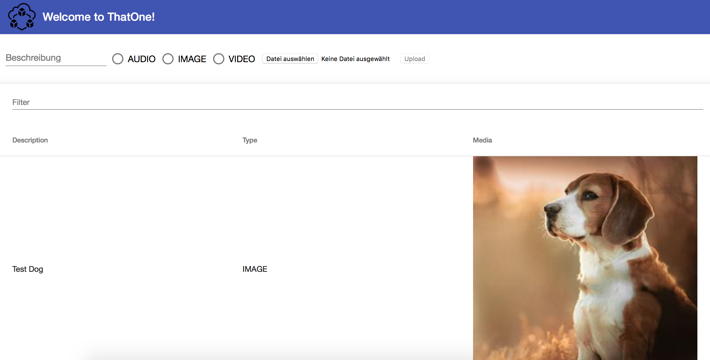

# Cloud Application Development

- Lukas Groß
- Max Stenke
- Jan-David Schindler
## Technologies

- Java
- Spring Boot
- Maven
- Swagger (UI)
- TypeScript
- Angular
- NPM
- PostgreSQL DB
- Docker (-compose)

## Backend (Spring Boot)
The backend is developed in Java with the Spring Boot Framework, built with Maven and represents a REST-Service.

### Getting Started

To start the Backend run 

```
mvn spring-boot:run
```
or execute the jar in the target directory.

### Spring Profiles

There are two profiles configured

`dev` which is active by default and uses useful features for development such like

- Using a H2 in Memory DB
- Dropping and creating the DB after start up
- Inserting test data

`prod` which has to be activated manually e.g. like this:

```
java -jar -Dspring.profiles.active=prod backend.jar
```

In production the backend uses a PostgreSQL DB. 

Schema creation is done by a SQL script which has to be placed inside the PostgreSQL directory.

### REST Endpoints

The Rest Endpoints are documented via Swagger which is available under [Swagger UI](http://localhost:8080/swagger-ui.html) after start.

## Frontend (Angular)

The frontend is developed using TypeScript and the Framework Angular.

For building the project run:

```
npm install
```

To start the frontend in development mode run:

```
npm start
```

The frontend is also a Maven project and can be built with:

```
mvn install
```

The artifact is a dependency in the backen project and get copied in the spring `static` folder and gets therefore shipped with the backend jar.


## Deployment (Docker)
For deployment use:

```
docker-compose up -d
```

The backend and the PostgreSQL DB get wired together via docker-compose and run in single containers.

Each container consists of a single Docker-Image:

- PostgreSQL DB Image (pulled from the Docker Hub)
- App-Image (built from the projects Dockerfile inheriting a Java image)

The App image is stored in the Docker registry Docker Hub and gets pulled from there while `docker-compose up`.

App-Image:

```
FROM java:openjdk-8u91-jdk
EXPOSE 8080
CMD java -jar -Dspring.profiles.active=prod backend*.jar
COPY backend/target/backend*.jar .
```


The hole application is deployed on an AWS EC2-Instance available [here](http://ec2-34-208-179-7.us-west-2.compute.amazonaws.com).

## Screenshot



